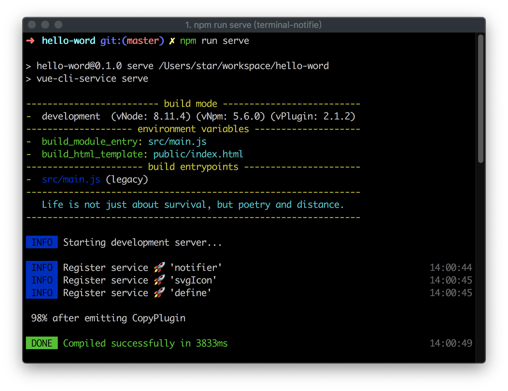
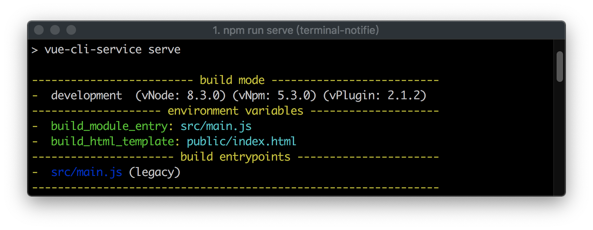
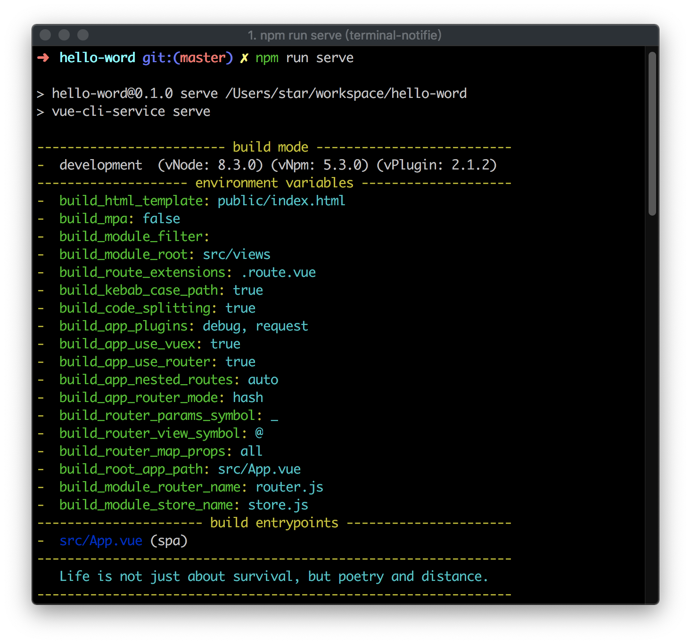
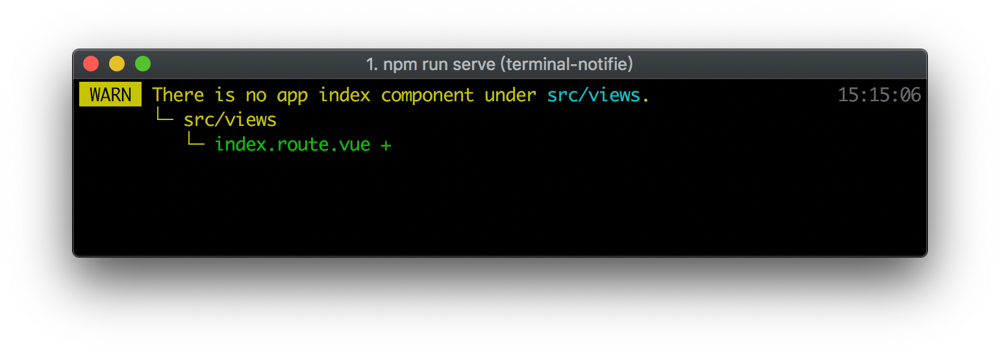
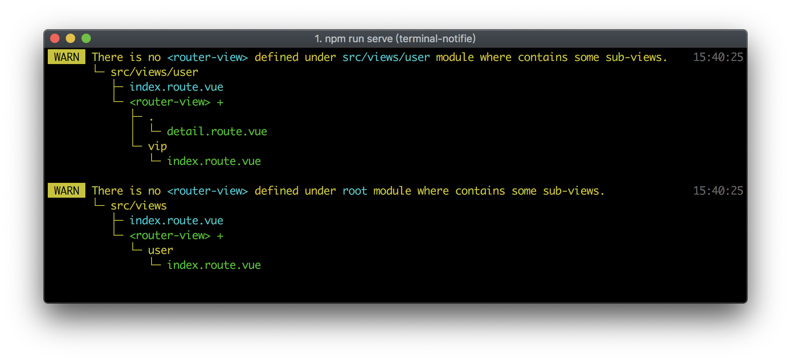

# 快速上手

以下名称 **ut-builder** 均指构建工具 [vue-cli-plugin-ut-builder](https://www.npmjs.com/package/vue-cli-plugin-ut-builder)，
其本质上是 [@vue/cli](https://cli.vuejs.org/zh/) 的插件。

## 环境准备

首先，你需要安装 [Node.js](https://nodejs.org/en/) 运行环境。

构建工具 ut-builder 依赖 **8.3.0** 以上版本的 node 运行环境。
因为从这一版本开始， node 运行环境提供了较完善的解构语法支持。

:::tip 提示
早期 1.x.x 版本的 ut-builder 最低是支持到 8.0.0 版本 node 的，由于此版本 node 的解构语法支持不完善，
又不想使用转译，写代码太难受，所以从 2.x.x 起就要求 8.3.0 以上 node 版本了。 😂
:::

:::warning 提示
如果你需要使用 @vue/cli 提供的脚手架来初始化创建工程的话，那么就需要安装至少 8.9.x 以上版本的 node。
:::

开发环境下，推荐尽量安装最新 **LTS** 版本的 [node](https://nodejs.org/en/download/)。

另外，你还可以使用 [nvm](https://github.com/nvm-sh/nvm)
或 [nvm-windows](https://github.com/coreybutler/nvm-windows) 来管理你本地的 node 版本。

```bash
# 查看已安装的 node 版本
node -v
```

相应地，在 node 环境下，你需要使用**包管理器**来管理项目依赖。

你可以使用 [npm](https://www.npmjs.com/) 或者 [yarn](https://www.yarnpkg.com/zh-Hans/) 来管理你的依赖包。
**这里的示例都将以 npm 作为包管理器**。

为提升安装效率，你还需要切换下包管理器默认的下载仓库源。

```bash
# 切换 npm 仓库源至国内镜像源，提升包下载速率
npm config set registry https://registry.npm.taobao.org
```

如果你需要频繁切换不同的源，[nrm](https://github.com/Pana/nrm)(**npm registry manager**) 会是一个不错的工具。

```bash
# 全局安装 npm 仓库源管理工具 nrm
npm i nrm -g

# 查看可用的镜像源
# nrm ls

# 切换到国内源
nrm use taobao
```

## 脚手架

**ut-builder** 本身并没有提供完整的脚手架工具，因为 @vue/cli 提供的脚手架已经足够好用了。甚至你还可以基于 @vue/cli 的配置，定制或开发自己喜欢的脚手架。

另外，[前面](./introduce.md#构建工具) 我们也了解到，ut-builder 本身就是一个 @vue/cli 插件。
所以，你可以**先使用 @vue/cli 初始化创建工程，然后再添加 [ut-builder](https://www.npmjs.com/package/vue-cli-plugin-ut-builder) 插件**。

如果你只想单独使用 ut-builder 这个插件也是可以的，甚至你还可以只使用 icefox 包里面的一些组件。
后面我们会提一些需要注意的地方，但在这里，推荐你按照下面的示例，先创建一个完整的示例项目。

首先我们需要 **安装 vue 官方命令行构建工具**：

```bash
# 老版本命令行工具会对新版工具造成影响
# 如果已安装过老版工具，你需要先卸载它
# npm uninstall vue-cli -g

# 全局安装 @vue/cli 命令行构建工具
npm i @vue/cli -g
```

你也可以在 [这里](https://cli.vuejs.org/zh/guide/installation.html) 了解下 vue 官方关于命令行构建工具的安装说明。

接下来我们创建一个示例项目：

```bash
# 在合适的工作目录下，创建一个名为 hello-world 的项目
vue create hello-world
```

交互式命令行会提示你选择一些构建特性，你可以根据你的需要来选择，然后脚手架就会帮我们创建好项目的基本结构了。

:::tip 提示
icefox **内置的主题样式是基于 Less 预编译样式语言**的，这里我们推荐你在选择样式预处理器(CSS Pre-processors)时，将 **Less** 选上。
其他一些特性，比如 Babel、Linter / Formatter、Router、Vuex，一般都是需要的了。
代码风格配置选项里，ESLint + Prettier 的组合还不错。最后将配置文件单独外置，在需要以编程方式进行配置时将会更加便利。
:::

[这里](https://cli.vuejs.org/zh/guide/creating-a-project.html) 是 vue 官方使用命令行工具创建项目的详细示例，有兴趣的话你也可以过去瞧瞧。

创建好项目后，我们还需要添加下 [ut-builder](https://github.com/utryfe/vue-cli-builder#readme) 插件。
在安装插件前，推荐你先看一下 vue 官方关于 [命令行工具插件](https://cli.vuejs.org/zh/guide/plugins-and-presets.html) 的说明，
当然往后你再去了解也是可以的。

```bash
# 进入到示例项目根目录
cd hello-world

# 添加 ut-builder 插件
vue add ut-builder

# 或者直接使用 npm 安装开发依赖（注意依赖名称与上面的不同）
# npm i vue-cli-plugin-ut-builder -D
```

安装完成后，就可以运行命令，看看效果了。

```bash
# 启动开发服务器
npm run serve
```

如果没有遇到错误的话，你应该会看到类似下面这样的控制台输出，这里我们也暂且不需要了解这些输出项的意义。



:::tip 提示
2.x.x 以上版本的 ut-builder 在运行后会默认将 icefox 添加进 package.json 的依赖声明中，
这是因为 icefox 为内置的组件提供了声明文件，以便在 IDE（如：WebStorm）中获取编辑器智能提示的能力，而前提是需要将包添加进项目依赖声明中。
另外，deploy、stage 两个 npm 脚本命令也会被添加进 package.json 中。
:::

:::warning 提示
虽然你还可以安装其他的 @vue/cli 插件来丰富项目的构建能力，但这里其实是不太推荐你安装过多的其他插件的。
这是因为构建是个复杂的事情，ut-builder 本身已经实现了很多常用的构建特性，也会尽最大的努力来保证构建的稳定性。
另外，原则上 ut-builder 严格在 [@vue/cli 配置](https://cli.vuejs.org/zh/config/) 的基础上做增强，换言之你可以自己定义一些基础配置，
ut-builder 会考虑到用户自己的配置并做相应增强。其他命令行插件的构建行为也有可能会与 ut-builder 的构建行为相冲突。
:::

**ut-builder** 提供了较丰富的 [构建配置项](../config/builder.md)，能满足常用的 App 构建需求。这也是上面提到的，你可以把它 **单独作为一个构建插件** 来使用的原因。

在这里，结合 icefox，我们看看还能多做一些什么。

## 使用 icefox 组件

[icefox](https://github.com/utryfe/icefox) 提供了一些可快速搭建企业级中后台系统框架的组件和工具，其本身也依赖于 [element-ui](https://element.eleme.cn/#/zh-CN) 的一些基础组件。
与 element-ui 类似，我们也有两种方式来使用 icefox 提供的组件。

一种是直接从 [icefox](https://www.npmjs.com/package/icefox) 包里面导入需要的组件使用。

```vue
<script>
import { AsideMenu } from 'icefox'

export default {
  name: 'MyComponent',
  components: { AsideMenu },
}
</script>
```

另外一种是以 **vue 插件** 的形式全局安装 icefox 下的所有组件。

```js
import Vue from 'vue'
import icefox from 'icefox'

// 安装vue插件
Vue.use(icefox)
```

```vue
<template>
  <!--  在单文件组件模板中使用 icefox 组件，组件名都以 ice- 前缀开头 -->
  <ice-aside-menu />
</template>
```

:::tip 提示
由于存在依赖关系，以 vue 插件的形式安装 icefox 时，element-ui 默认也会作为插件被安装。
导入 icefox 包的同时，element-ui 的主题样式文件也会被同步导入。
换言之，如果以 vue 插件形式安装 icefox 后，你不需要再安装 element-ui 和导入其主题样式了。
:::

就像上面这样，我们可以把 icefox 里面的组件单独拿来使用，它表现得就像个第三方的组件包一样。

下面是个引用边栏菜单组件，并通过数据来生成菜单的例子：

```vue
<template>
  <aside-menu :menu-items="items" default-active="id_2" style="width:200px" />
</template>

<script>
import { AsideMenu } from 'icefox'

export default {
  name: 'MyComponent',
  components: { AsideMenu },
  data() {
    return {
      items: [
        { id: 'id_1', title: '菜单项一' },
        { id: 'sub', title: '子菜单', children: [{ id: 'id_2', title: '菜单项二' }] },
      ],
    }
  },
}
</script>
```

运行结果：

<ice-aside-menu 
  default-active="id_2" 
  style="width:200px" 
  :menu-items="[{ id: 'id_1', title: '菜单项一' },
   { id: 'sub', title: '子菜单', children: [{ id: 'id_2', title: '菜单项二' }] }]"
/>

<br>

是不是看起来还不错？实际上底层组件仍旧是 [element-ui](https://element.eleme.cn/#/zh-CN/component/installation)
的 [Menu](https://element.eleme.cn/#/zh-CN/component/menu) 组件，icefox 对其进行了**高阶封装**，
扩展了它的能力，也使得它更易于在项目中使用，还为它量身定制了一些主题样式，使得在项目中可以通过 Less 变量来定制一些风格。

如果你想去看一下代码，[AsideMenu](https://github.com/utryfe/icefox/blob/master/lib/components/AsideMenu/AsideMenu.vue) 和
[Menu](https://github.com/utryfe/icefox/blob/master/lib/components/Menu/ElementMenu.vue) 这两个组件就是上面的实现了。

事实上，**icefox 大部分组件都是对其他基础组件的高阶封装**，目前我们是基于 element-ui 来封装的，
当然也可以封装其他组件库的基础组件了，但目前我们并未打算这样去做。

如果你熟悉了 element-ui 的使用，那么大部分 icefox 组件你也就会用了。高阶意味着属性继承，换言之，**原有组件的属性及行为都会得以保留**。

**icefox** 自己也实现了一些很不错的组件，机会留给以后，这里我们就不做过多的探讨了，下面我们可以去看看另外一些有意思的地方。

## 约定式路由

约定式路由，即根据约定的目录结构和文件名称，自动生成路由配置代码及应用框架。如果你了解
[Nuxt](https://zh.nuxtjs.org/) 或 [UmiJS](https://umijs.org/zh/)，那就很容易明白了。他们也是这么干的。
但这里并不是照搬他们的实现。

事实上，受这种思想的启发，我们觉得这是个不错的提效手段，但 Nuxt 偏向于服务端渲染，
UmiJS 是 React 派系，而 icefox 趋向于辅助应用开发，并尽力帮助小伙伴们降低企业应用开发的门槛。

如果你不喜欢以这种方式来构建你的应用，那作为一个普通的构建插件和组件包，你也能用上一些东西。如果你很感兴趣，那么我们接下来就会了解更多了。

启用这个特性，需要开启 ut-builder 的一些配置项。在这之前，我们先来了解一下目前项目的基本结构。

如果你是使用 @vue/cli 脚手架初始化创建的项目，那么脚手架帮你生成的项目结构会类似下面这个样子：

```
.
├── node_modules                // 模块依赖安装目录
├── public                      // 公共资源文件目录
│   ├── favicon.ico
│   └── index.html              // 页面模板
├── src                         // 源码及资源目录
│   ├── assets                  // 引用静态资源目录
│   │   └── logo.png
│   ├── components              // 模块组件目录
│   │   └── HelloWorld.vue      // 模块组件
│   ├── views                   // 页面路由组件目录
│   │   ├── About.vue           // 路由组件
│   │   └── Home.vue
│   ├── App.vue                 // 路由根出口组件
│   ├── main.js                 // 应用初始化文件
│   ├── router.js               // 页面路由定义文件
│   └── store.js                // 应用状态定义文件
├── .browserslistrc             // 浏览器兼容声明文件
├── .eslintrc.js                // 代码风格检查定义文件
├── .gitignore
├── README.md
├── babel.config.js             // babel配置文件
├── package-lock.json
├── package.json
└── postcss.config.js           // postcss配置文件
```

这是一个典型的 **单页应用(SPA)** 项目结构。ut-builder 能够很好的支持这种结构形式的项目构建。
从控制台构建输出也能看到一些关键信息：



**启用约定式路由后，应用的初始化会被 icefox 框架接管**，而我们也需要对现有的一些文件进行调整修改。
修改后的项目资源结构如下（注意 **...** 部分表示版面省略而非删除了）：

```{9,10,12,14}
.
├── ...
├── src
│   ├── assets
│   │   └── logo.png
│   ├── components
│   │   └── HelloWorld.vue
│   ├── views                   // 页面路由组件目录
│   │   ├── About.route.vue
│   │   └── Home.route.vue
│   ├── App.vue                 // 路由根出口组件
│   └── main.js                 // 应用初始化文件
├── ...
└── vue.config.js               // 构建配置文件
```

这里我们删除了 **src** 目录下面的 **router.js** 和 **store.js** 文件，也在**项目根目录**下新建了一个 [vue.config.js](https://cli.vuejs.org/zh/config/#vue-config-js) 文件（如果没有的话）。
另外，我们还修改了**路由组件的文件后缀名称**，将 **.vue** 改为了 **.route.vue**。

:::tip 提示
需要说明下的是，**特定后缀名**是为了让构建工具能够区分出那些路由组件，并生成对应的路由配置。
另外基于特定后缀名称也能很直观的知道哪些是路由组件，哪些是非路由组件。
如果你不喜欢这样的设定，后缀名也是可配置的，你甚至可以将其配置成 **.vue**，那么该目录下所有的单文件组件都会被当成路由组件来对待了。
:::

接下来，我们还需要修改下 **main.js** 文件的内容。下面是个参考：

```js
import icefox from 'icefox'

const requestPluginOptions = {
  baseParams: {
    baseUrl: '',
  },
  headers: {},
}

export default {
  title: '网站标题',

  created() {
    // 应用创建完成后的回调
  },

  plugins: [
    // 将icefox作为应用插件使用
    icefox,
    // 对内置的request插件进行配置
    ['request', requestPluginOptions],
  ],

  router: {
    // vue-router 配置对象
    mode: 'hash',
    created(/*router*/) {
      // 路由器创建完成后的回调
    },
  },

  store: {
    // Vuex Store 配置对象
    created(/*store*/) {
      // Store创建完成后的回调
    },
  },
}
```

现在我们暂时不需要了解 **main.js** 内容的具体细节，后面我们会有专门的文档来说明。
从代码我们可以看出，Vue **插件的安装**，以及 **Router**、**Store**、**App** 的实例化，都是由框架来接管的了。

现在我们还需要更改构建配置文件，并启用代码自动生成以及 App 框架能力。这是在 **vue.config.js** 配置文件里通过 `preprocess` 配置项来声明的。
下面是个参考：

```js{3}
module.exports = {
  pluginOptions: {
    preprocess: true, // 启用代码预处理
  },
}
```

重新运行构建命令 `npm run serve`，不出意外的话，你应该会看到类似下面这样的控制台输出：



而浏览器网页地址栏却变成了 `localhost:8080/#/404`，且示例的 Home 页面路由(`/`) 也没有正常显示。
不要着急，我们还需要进行一些小的调整才能使得页面显示正常。

你可能也已经注意到了，在构建控制台里会有一个提示内容：



意思是需要在 `src/views` 目录下添加一个 `index.route.vue` 单文件组件。按照提示，我们新建一个组件试试。
组件模板内容任你喜欢好了。建好后，我们再把浏览器地址更改为 `localhost:8080/#/`，是不是已经看到你刚刚创建的内容了？

这里，我们知道了，在一个目录下面，命名为 `index.route.vue` 的单文件组件，会被当作该目录路径下的路由( `Layout` )组件。

你也可以接着往 `src/views` 目录下添加更多的单文件组件（路由组件文件名称以 `.route.vue` 结尾）或嵌套目录。

下面是一个随意添加的目录文件结构：

```{4,6,7,8,9,11}
src/views
├── user
│   ├── vip
│   │   └── index.route.vue
│   ├── boo.vue
│   ├── detail.route.vue
│   └── index.route.vue
├── About.route.vue
├── Home.route.vue
├── Normal.vue
└── index.route.vue
```

:::tip 提示
打开浏览器(Chrome)开发者工具，通过快捷键(`⌘ P` 或 `Ctrl P`)打开资源搜索栏，键入 `.code/index`搜索，即可找到生成的路由配置代码文件。
在项目的 `node_modules/.code` 目录下，你也可以找到这一代码文件。
:::

根据以上目录文件结构，生成的路由配置代码如下：

```js{8,15,22,29,40,47}
const router = {
  mode: 'hash',
  base: '/',
  routes: [
    {
      filePath: 'src/views/index.route.vue',
      name: '/',
      path: '/',
      component: compIndex,
      props: mapRouteParamsToProps,
      children: [
        {
          filePath: 'src/views/user/index.route.vue',
          name: 'user',
          path: '/user',
          component: compUserIndex,
          props: mapRouteParamsToProps,
          children: [
            {
              filePath: 'src/views/user/detail.route.vue',
              name: 'user/detail',
              path: 'detail',
              component: compUserDetail,
              props: mapRouteParamsToProps,
            },
            {
              filePath: 'src/views/user/vip/index.route.vue',
              name: 'user/vip',
              path: 'vip',
              component: compUserVipIndex,
              props: mapRouteParamsToProps,
            },
          ],
        },
      ],
    },
    {
      filePath: 'src/views/About.route.vue',
      name: 'About',
      path: '/about',
      component: compAbout,
      props: mapRouteParamsToProps,
    },
    {
      filePath: 'src/views/Home.route.vue',
      name: 'Home',
      path: '/home',
      component: compHome,
      props: mapRouteParamsToProps,
    },
  ],
}
```

其中一些变量是对导入组件的引用。另外，在构建控制台也会有以下提示内容：



正如你所看到的那样，创建或更新路由组件文件后，构建工具会自动生成新的代码，并作出相应的提示。
这一过程中你也不需要重新启动构建。
ut-builder 提供了 `3` 种模式来生成路由代码，并完善支持动态参数路由、命名路由以及嵌套子路由。
这里我们不作过多的展开，后面会有专门的文档。如果你想再多尝试几下的话，这里有一些提示也许能帮到你：

:::tip 提示
`preprocess` 配置项可使用对象传参，属性 `appNestedRoutes` 可指定嵌套模式， 有 3 个枚举值，分别为 `auto`、`manual`、`none`。
默认为 `auto` 模式。`manual` 模式下，目录名称以`[]`包裹的，表示需要生成嵌套子路由。任意模式下名称以 `~` 开头的路由文件或目录，将会提升为根路由子节点。
以 `@` 开头的路由文件或目录，表示命名路由，而以 `_` 开头的表示动态参数路由，动态参数路由以 `_` 结尾表示可选参数。`@` 和 `_` 这两个符号可通过配置来变更。
:::

基于以上了解，我们就可以将示例的 `Home` 组件对应的路由页面重新显示出来了，访问 `/home` 路由即可。
你也可以修正下示例 `src/App.vue` 文件内的路由链接地址信息。

另外你也许会疑惑，基于 icefox 的应用框架，又该怎样引入 store.js 文件呢？这个在进阶的
[Store 模块化](./store-module.md) 里面，我们会有专门的讲解。

## 接口请求与 Mock

我们的应用一般需要与后端服务进行交互，这就要用到远程请求了。icefox 的应用框架（**需启用约定式路由**），基于
[axios](https://www.npmjs.com/package/axios) 封装了发送 HTTP 请求的能力，且作为一个插件默认被安装进了应用中。

你可以通过以下几种方式来调用请求插件：

```js{}
// 在组件中
this.$http.get('/api/xxx')

// 在非组件中
Vue.$http.get('/api/xxx')

// 在 Store 的 actions 中
async someAction({call, dispatch}, payload) {
  await call('/api/xxx')
}
```

:::tip 提示
请求插件 `$http` 是对 `axios` 的"高阶"扩展封装，因此 `axios` 的所有能力及使用方式，都可以被运用。换言之，如果你熟悉了 `axios` 的使用方式，
`$http` 就是 `axios` 的"别名"而已。但这并不是简单的引用，后面我们会有专门的文档说明。如果你对源码感兴趣的话，
[request](https://github.com/utryfe/icefox/blob/master/lib/plugins/request.js) 插件正是这个封装的实现。
:::

我们在示例项目的 `Home.route.vue` 单文件组件里演示下发送请求的操作。这里我们模拟一个获取用户姓名并在页面上显示问候语的场景。
先来作一些小的修改，添加一点请求服务端接口的逻辑：

```vue{4,16,17,18,19,20,22,23,24,25,26,27}
<template>
  <div class="home">
    
    <HelloWorld :msg="msg" />
  </div>
</template>

<script>
// @ is an alias to /src
import HelloWorld from '@/components/HelloWorld.vue'

export default {
  name: 'Home',
  components: { HelloWorld },

  data() {
    return {
      msg: 'Welcome!',
    }
  },

  async created() {
    // 发送请求，加载用户信息
    const user = await this.$http.get(`{baseUrl}/api/user/info`).data
    // 更新并显示问候语
    this.msg = `${user.name}, Welcome!`
  },
}
</script>
```

:::tip 提示
我们在示例代码里面应用了 [async/await](https://developer.mozilla.org/zh-CN/docs/Web/JavaScript/Reference/Statements/async_function) 语法。
另外，在编写异步请求代码时，推荐大家都采用这种语法形式。
:::

访问 `/home` 路由页面（以下均同），打开浏览器（**Chrome**）的开发者工具，切换至 `Network` 面板，我们可以看到地址为 `/api/user/info` 的请求已经被浏览器发送了。
因为没有合适的服务端接口，这里我们会看到一个状态码为 `404` 的请求响应。

也许你已经注意到了示例代码中的请求地址 `{baseUrl}/api/user/info`，其中包含一个 `{baseUrl}` 的占位变量（**注意占位变量前面并没有 ES6 模板字符串的 `$` 引导符号**）。
我们可以声明下这个占位变量的值。

如果你还记得前面 `main.js` 示例代码的话，里面就有这个变量的声明，它是在内置的 HTTP 请求插件的配置对象属性 `baseParams` 里定义的。

:::tip 提示
变量名 `baseUrl` 只是示例需要而已（注意区别 `axios` 配置参数 `baseURL` ），你可以定义成任何你喜欢的名称。实际上 `baseParams` 是插件在 `axios` 配置的基础上扩展出的配置项，
它提供了一种便捷的方式来使用一些与请求相关的常量或参数值。你可以在请求地址里面方便的嵌入这些常量或参数值，而不需要频繁地在组件中通过模块导入的形式来引入这些值。
:::

我们可以给这个 `baseUrl` 赋上远程服务器地址的值，例如：`10.0.2.68:8088` 。再次查看接口请求信息，你会发现请求服务器地址已经变更为刚刚配置的地址值。

为了模拟服务端接口响应，我们接下来启用构建工具提供的接口 **Mock 与代理** 能力。启用方式也很便捷，在 `vue.config.js`
配置文件的插件配置项里，声明 `mock` 服务配置即可。下面是个参考：

```js{8,9,10}
module.exports = {
  pluginOptions: {
    preprocess: {
      appNestedRoutes: 'auto',
    },

    // 构建服务配置
    services: {
      mock: true, // 启用mock服务
    },
  },
}
```

:::warning 提示
插件配置项名 `services` 需要 `vue-cli-plugin-ut-builder` 版本在 `2.1.4` 以上。`低于 2.1.4` 的版本，请使用 `service` 。
:::

更新 `vue.config.js` 配置文件，手动重启构建服务，等待构建完成后，刷新页面继续查看接口 `/api/user/info` 的网络请求，你会发现请求服务器地址已经变更为本机地址。

查看示例项目的根目录，可以看到有一个新的文件夹被自动创建了，其目录文件结构如下：

```{3}
mock
├── api
│   └── user.js
├── mock.data.json
└── mock.demo.js
```

打开 `api/user.js` 文件，我们可以看到，构建工具早已帮我们创建好了接口响应声明（ `GET /api/user/info` ）。
因为后面会有专门的文档来讲解 Mock 模块的使用，这里我们先返回一些数据，好让页面能够正确获取到用户信息。下面是个参考：

```js{4,8,9,10}
import Mock from 'mockjs'

export const delay = 0
export const disabled = false

export default {
  // 接口响应定义
  'GET /api/user/info': (req, res, next) => {
    return Mock.mock({ name: '@cname(2, 4)' })
  },
}
```

:::warning 提示
默认参数设定下，自动生成的 mock 模块中，`disabled` 变量的值是为 `false` 的。你需要将其改为 `true`，才会使得该 mock 模块生效。
另外，这些默认设定也可以通过 mock 构建服务的配置参数来变更。如果启用了应用框架能力，mock 能力也会根据不同的构建模式与应用无缝衔接。
:::

刷新页面试试，是不是已经能够看到页面上带称谓的问候语了？
接下来你也可以尝试下禁用 mock，或者更改接口响应返回值，看看网页上的接口请求及响应会发生怎样的变化。

:::tip 提示
**Mock** 能力是 **ut-builder** 的强大特性之一。支持自动代理无缝衔接应用，可根据接口请求信息自动生成 mock 模块文件并定位至代码行，
以及根据远程接口数据自动生成 [MockJS](http://mockjs.com/) 随机数据生成代码。mock 模块文件可使用 es6 语法，支持实时转译更新。
可设置延时响应时长，也支持模块以及模块内单个接口的本地与远程响应实时切换。
另外，对于 `WebSocket` 的模拟，也提供了与构建无缝衔接的精美网页客户端应用，可手动或自动模拟 `socket` 推送数据，
并支持常见的浏览器端 `websocket` 协议实现（`websocket`、`sockjs`、`socket.io`、`STOMP`）。
:::

## 发布预览与部署

🛠 建设中...
